# NETWORKING THEORY : FROM START TO MODERN

## the alarm of invention
On October 4, 1957, The Story begin when cold war was it height the Soviet Union launched the world’s first artificial satellite into orbit. The satellite, known as **Sputnik**, did not do much: It relayed blips and bleeps from its radio transmitters as it circled the Earth. Still, to many Americans, the beach ball-sized Sputnik was proof of something alarming.

the federal government itself formed new agencies, such as the National Aeronautics and Space Administration (NASA) and the Department of Defense’s Advanced Research Projects Agency (ARPA), to develop space-age technologies such as rockets, weapons and computers.

## The starting of Networking
The Us government wanted a better command-and-control system cause the old telephone system was good but was considered **vulnerable**.  
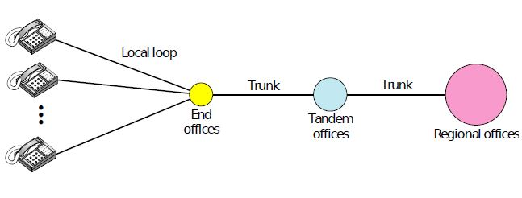  
problem was destruction of any one office resulted in breaking of communication.

### The idea of routing

for this DoD awarded contract to RAND Corporation to find a solution. one employee **Paul Baran** came up with highly distributed and fault tolerant design **packet switching**.

* * *

*packet switching* - *refers to deciding the best route for data transmission if there are multiple paths in a larger network*

* * *

Paul Baran wrote many reports to Dod , Offical at Pentagon liked the concept and asked AT&T but they dissmised it . The biggest and richest corporation in world was not about to let some young whippernapper tell it how to build a telephone system, and the idea was killed.

### Launch of ARPANET
in In 1965, After some years Donald Davies, employe of ARPA suggested building a packet-switched subnet giing each host its own router.
after some initial skepticisn roberts (director of ARPA) bought the idea and presented it at a ACM SIGOPS Symosium on Operating system principle held in Gatlinburg.
He was shocked to find another paper at conference described a similar system that had not only been designed but actually implimeted under the direction of Donald Daies at the National Physical Laboratory in England.
Robert came away from Gatliburg determined to build what later became known as the **ARPANET**.

### Mechanism OF ARPANET
ARPANET worked by connecting computers through a packet-switching network, which was a novel concept at the time. Instead of sending entire messages in one continuous stream (like traditional telephone lines), data was broken into smaller chunks called packets. Each packet contained not only a portion of the data but also metadata, like its destination address and sequence number, allowing it to be routed independently across the network. 

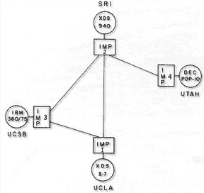

These packets traveled through a series of nodes, called **Interface Message Processors (IMPs)**, which were essentially early routers. IMPs determined the best available path for each packet to reach its destination, optimizing for efficiency and reliability. Once all packets arrived at the destination, they were reassembled into the original message.

### Building of ARPNET
ARPA then put out tender for building subnet. Twelve companies bid for it . after some evaluating BBN was chosen . a consulting firm in Cambridge , Massachusetts , and in December 1968 awarded it a contract to build the subnet and write the subnet software.
 
--

# INTRODUCTION TO NETWORKING

computer network is set of nodes connected by communication links.

node = device

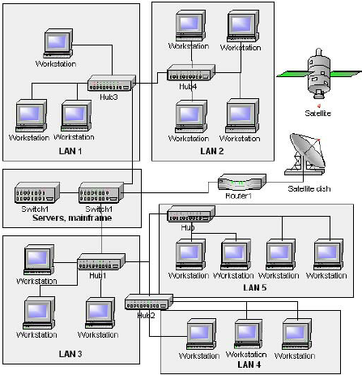

## data flow

- Simplex
- Half Duplex
- Full Duplex

## Protocols

Protocol = Rule

protocol is set of rules that govvern data communication.

#### steps

- Message encoding
- Message formatting
- Message timing
- Message size - flow control/response timeout
- Message delivery options - unicast/multicast/broadcst

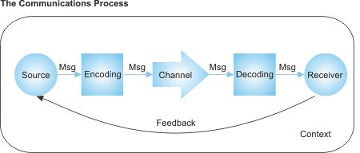

## Components

1.  **Media**
    - **Wired Medium (Guided)**
        
        1.  Ethernet straight-through
        2.  Ethernet crossover cable
        3.  Fiber Optic cable
        4.  Coaxial cable
        5.  USB cable
    - **Wireless Medium (Unguided)**
        
        1.Inftated  
        2.Radio  
        3.Microwaves  
        4.Satellite
        

## Classification

1.**Local Area Network (LAN)**  
network that interconnects computer within a limited area :- residence , campus or office building.  
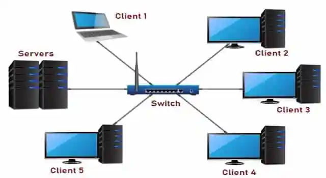  
2\. **Metropolitan Area Network (MAN)**  
network that interconnects computer in geographic region of the size of a **metropolitan area (city)**.  
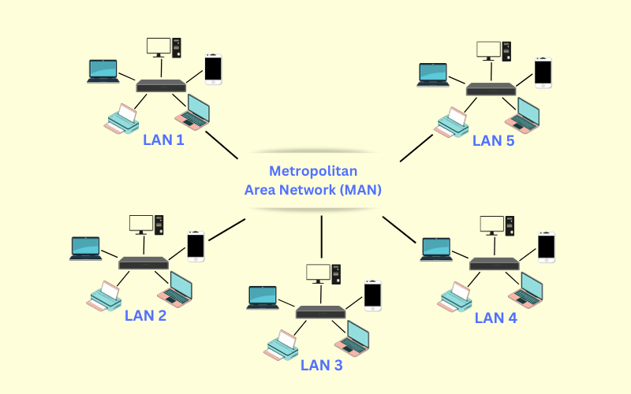  
3.**Wide Area Network (WAN)**  
network that extend over a large geographical area.  
ex:- Delhi to Tamil Nadu.  

## Network Topology

Topology = layout

1.  **Bus**  
    transmission over common medium (wire).  
    issue: broadcast to all.
    
    
2.  **Ring**  
    also called peer-to-peer LAN topology. send and rev data with help of **TOKEN**.  
    token = his turn to send data  
    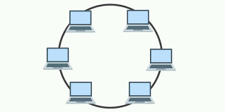
    
3.  **Star**  
    Every node is connected to a central node called hub or switch.  
    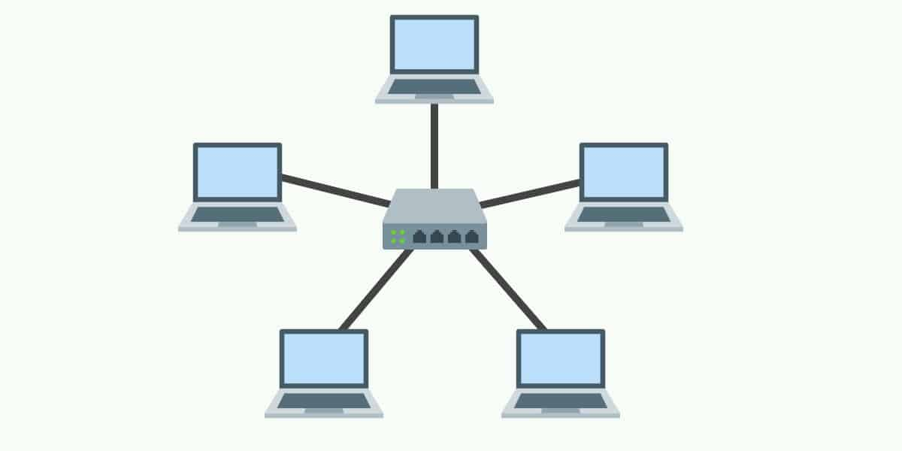
    
4.  **Mesh**  
    Every node is connected to a every other nodes.  
    

	**gateway** :- A gateway is a network node that connects two networks that use different protocols. It's often a combination of a router and a modem. ex:-router

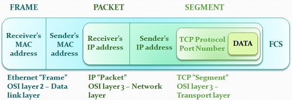

* * *
## ROUTER

***A Router is a networking device that forwards data packets between computer networks.** *

**Dynamic Host Configuration Protocol (DHCP)** :- is a network protocol that automatically assigns IP addresses and other configuration information to devices on a network.

**network address translation (NAT)** :- A network address translation (NAT) network is a network that uses NAT to map private IP addresses to a public IP address. This allows multiple devices to share a single public IP address. 

- The router keeps a table mapping internal IPs and ports to external ports.
- Responses are matched based on the destination port in the response packet.
- This method (PAT) allows many private IPs to share a single public IP.

NAT 
Public ip ----> private ip

Private ip ----> public ip

**Whats the work of NAT?**
intended for, by translating the incoming public IP address and port number back to the **private IP address and port number** of the correct device within the network

**who assign public ip address?**
Internet service providers (ISPs) 

 *routers in the middle of the internet, particularly those owned by ISPs and large networks, have publicly accessible IP addresses*

**how traceroute get path routers ip?**
**TTL (time to live)** is used for to get the packet back from a router. in which traceroute works.
for example when TTL is 0 router says nah its dead and give back the data to the sender.
 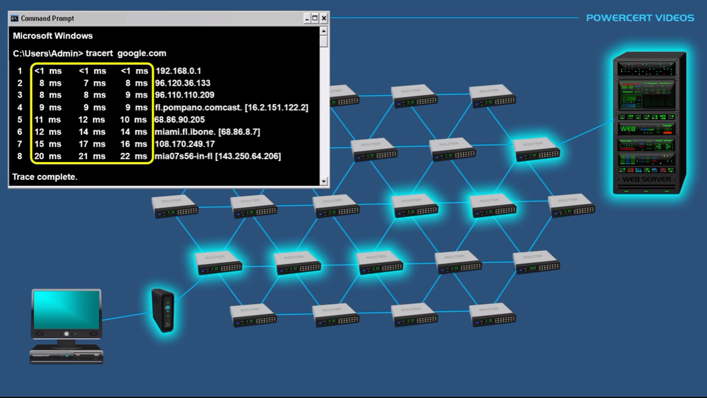

* * *
 
## DNS

1. When we type a website like https://www.example.com in our browser, our computer tries to find the IP address.
2. First, it checks the **local cache** (our browser, operating system, or router) to see if it already knows the IP address.
3. If the local cache doesn’t have the IP, the query is sent to a **DNS resolver (ISP DNS SERVER)*** to find it.
4. DNS resolver may check host files (used for specific manual mappings), but usually, it moves on.
5. Resolver sends the query to a **Root DNS server**, which doesn’t know the exact IP address but points to the TLD server (e.g., .org server for this example).
* * *
*funfact :- There are only 13 Root DNS Server in world controlled by different organization.*
* * *
6. TLD server then directs the resolver to the authoritative nameserver for geeksforgeeks.org.
7. Authoritative nameserver knows the exact IP address for geeksforgeeks.org and sends it back to the resolver.
8. Resolver passes the IP address to our computer.
9. Our computer uses the IP address to connect to the real server where the website is hosted.
10. The website loads in our browser.

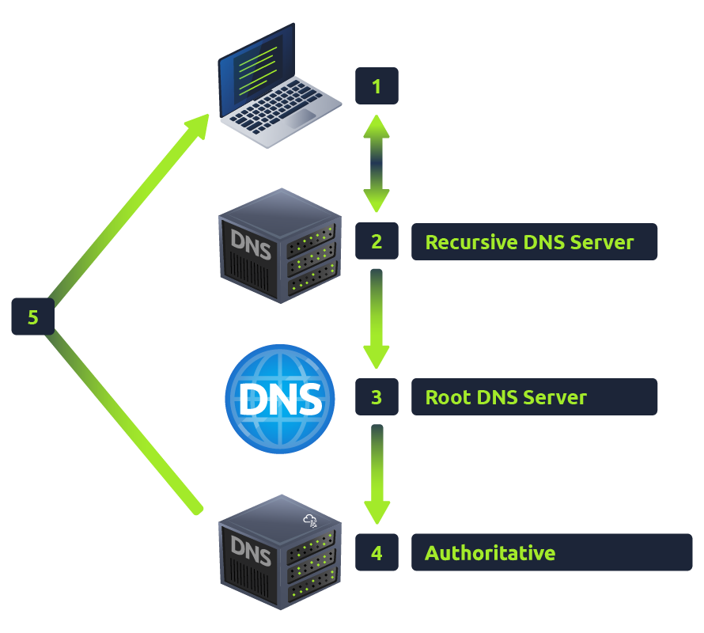

**Root DNS server** -> store TLD server address.
**TLD server (.com,.org)** -> store  Authoritative nameserver address.
**Authoritative nameserver** -> store ip of domain/

* * *

### DNS RECORD TYPE
A Record

These records resolve to IPv4 addresses, for example 104.26.10.229

AAAA Record

These records resolve to IPv6 addresses, for example 2606:4700:20::681a:be5

CNAME Record

These records resolve to another domain name, for example, TryHackMe's online shop has the subdomain name store.tryhackme.com which returns a CNAME record shops.shopify.com. Another DNS request would then be made to shops.shopify.com to work out the IP address.

MX Record

These records resolve to the address of the servers that handle the email for the domain you are querying, for example an MX record response for tryhackme.com would look something like alt1.aspmx.l.google.com. These records also come with a priority flag. This tells the client in which order to try the servers, this is perfect for if the main server goes down and email needs to be sent to a backup server.

TXT Record

TXT records are free text fields where any text-based data can be stored. TXT records have multiple uses, but some common ones can be to list servers that have the authority to send an email on behalf of the domain (this can help in the battle against spam and spoofed email). They can also be used to verify ownership of the domain name when signing up for third party services.

# FRAMING

framing in data link layer seprates a frame distigusable from another frame

**frame = header + networklink layer + trailer**

the computer A sends frames(bits) to computer B from its frame memory.
the computer B collects all bits in frame memory and create a frame.

#### types of framing
1. **Fixed size framing**
   here the size of fames are fixed so that the frame length act as delimeter of the frame.
	   ex = frame size set to 1024. so every frame will be that size if its small then 000.
2. **Variable-size framing**
   here the size of each frame is different.
   every frame starts with starting bits like 1011 and end bit 1011 so that reciever know when to stop.

## Byte-Oriented Protocols
Data is sent in blocks of bytes (usually 8 bits).
Use special characters (like SOH, STX, ETX) to mark frame boundaries.
Example protocols: BISYNC, PPP, DDCMP.
⚡ Problem: If data contains special characters, it needs character stuffing (escaping).

# Bit-Oriented Protocols
Data is sent as a stream of bits, not fixed blocks.
Use bit patterns (like 01111110 in HDLC) to mark frames.
Example protocols: HDLC, SDLC.
⚡ Problem: If data contains the frame marker, it needs bit stuffing (extra bits added).

### Bit Stuffing

example we send 1101001011101001101
if 1101 is starting bit and ending bit
we see that there is 1101 i between we can confuse the reciver

so sender add a extra 0 between it and when reciver recive the bits it removes the o bettwen them 

so now bits will be

before 1101001011101001101
after    110100101100101001101

## High-Level Data Link Control (HDLC)

HDLC is a bit-oriented, synchronous protocol for reliable data transmission.
It is used mainly in WANs, serial communication, and networking hardware.
Supports multiple operating modes for different network setups.

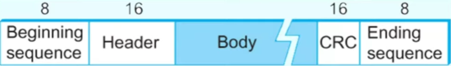

## Binary Synchronous Communications Protocol (BISYNC)

BISYNC is a character-oriented protocol developed by IBM for synchronous serial communication.
Uses synchronization characters (SYN) to maintain timing.
Relies on LRC or CRC for error detection.

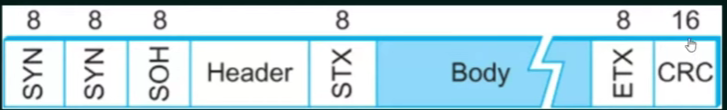

| Field                        | Size                 | Description                                      |
|------------------------------|----------------------|--------------------------------------------------|
| **Start of Text (STX)**      | 8 bits (`00000010`)  | Marks the beginning of a frame                  |
| **Header**                   | Variable            | Contains control information                    |
| **Data**                     | Variable            | The actual transmitted message                  |
| **Block Check Character (BCC)** | 16 bits          | Error detection using CRC or LRC               |
| **End of Text (ETX)**        | 8 bits (`00000011`)  | Marks the end of a frame                        |
| **Enquiry (ENQ)** / **Acknowledge (ACK)** | 8 bits | Used for flow control and error recovery       |

## Point-to-Point Protocol (PPP)
Point-to-Point Protocol (PPP) is a byte-oriented, data link layer protocol used for establishing a direct connection between two network nodes. It is primarily used in serial communications, such as dial-up connections, DSL, and VPN tunneling.

| Field                        | Size                 | Description                                      |
|------------------------------|----------------------|--------------------------------------------------|
| **Flag**                     | 8 bits (`01111110`)  | Marks the start and end of the frame            |
| **Address**                  | 8 bits (`11111111`)  | Broadcast address (always set to this value)    |
| **Control**                  | 8 bits (`00000011`)  | Defines an unnumbered frame                     |
| **Protocol**                 | 16 bits              | Specifies the encapsulated protocol (e.g., IP, IPv6) |
| **Data (Payload)**           | Variable            | The actual network layer data                   |
| **FCS (Frame Check Sequence)** | 16-32 bits         | CRC for error detection                         |

# OSI MODEL

### What is osi model?
OSI stands for Open System Interconnection is a reference model that describes how information from a software application in one computer moves through a physical medium to the software application in another computer.

*Yes, the OSI model is considered primarily a theoretical framework*

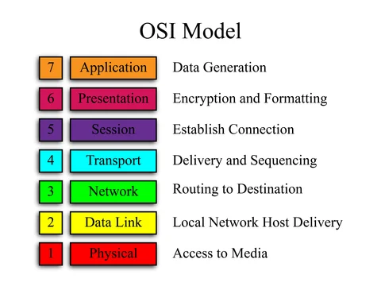

**These are the step data has to go and finally transmiting though wire (physical layer).**

### LAYERING
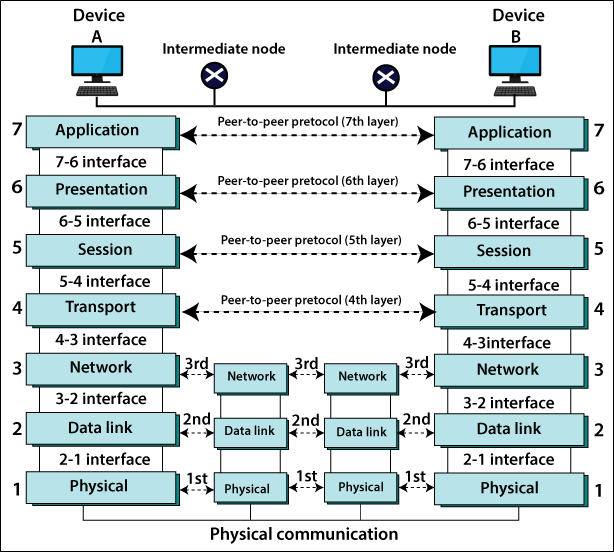

**Encapsulation** :- Encapsulation is the process of adding additional information when data is traveling in an OSI or TCP/IP model.(envelope)

Application -> preparation of Data
Presentation -> data format / encryption
Session -> starting a connection
Transport -> way of data flow (TCP/UDP)
Network -> Path routing/destination(IP) etc.
Data Link -> mac address / local
physical -> wire/median

SWITCH :- CHECK DATA LINK LAYER (MAC ADDRESS).
ROUTER :- OPEN ANOTHER LAYER NETWORK LAYER(destination).
Router also change the layer2 to new mac address

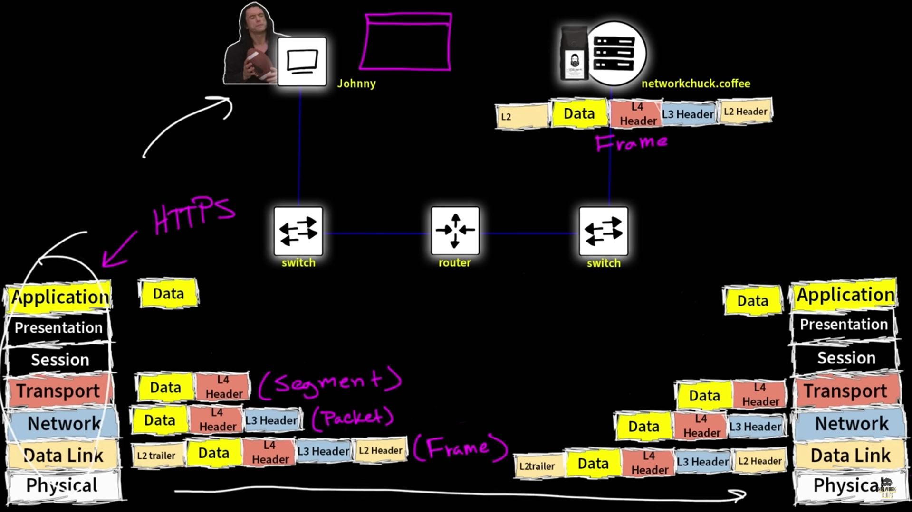

## How TCP works
**Establish a connection**: Two computers use a **three-way handshake** to establish a connection. 
**Send data packets**: The sender breaks down the data into packets, organizes them, and sends them to the destination. 
**Receive data packets**: The receiver acknowledges the receipt of each packet with an ACK segment. 
**Close the connection**: The connection is closed when the data transaction is complete. 

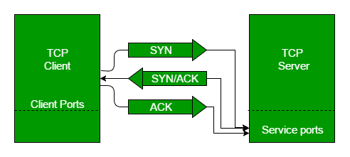

**Step 1 (SYN):** In the first step, the client wants to establish a connection with a server, so it sends a segment with SYN(Synchronize Sequence Number) which informs the server that the client is likely to start communication and with what sequence number it starts segments with

**Step 2 (SYN + ACK)**: Server responds to the client request with SYN-ACK signal bits set. Acknowledgement(ACK) signifies the response of the segment it received and SYN signifies with what sequence number it is likely to start the segments with

**Step 3 (ACK):** In the final part client acknowledges the response of the server and they both establish a reliable connection with which they will start the actual data transfer

*****************************************************************************
**ports** :- ports are virtual or physical endpoints that identify where network connections begin and end. They are used to direct traffic to specific applications and services

**Ephemeral ports** :- Ephemeral ports are temporary ports that allow client devices to connect to a server. They are also known as dynamic ports, private ports, or client ports.

When a client device initiates a connection to a server, the operating system assigns it an ephemeral port , The client device uses the ephemeral port to communicate with the server. 

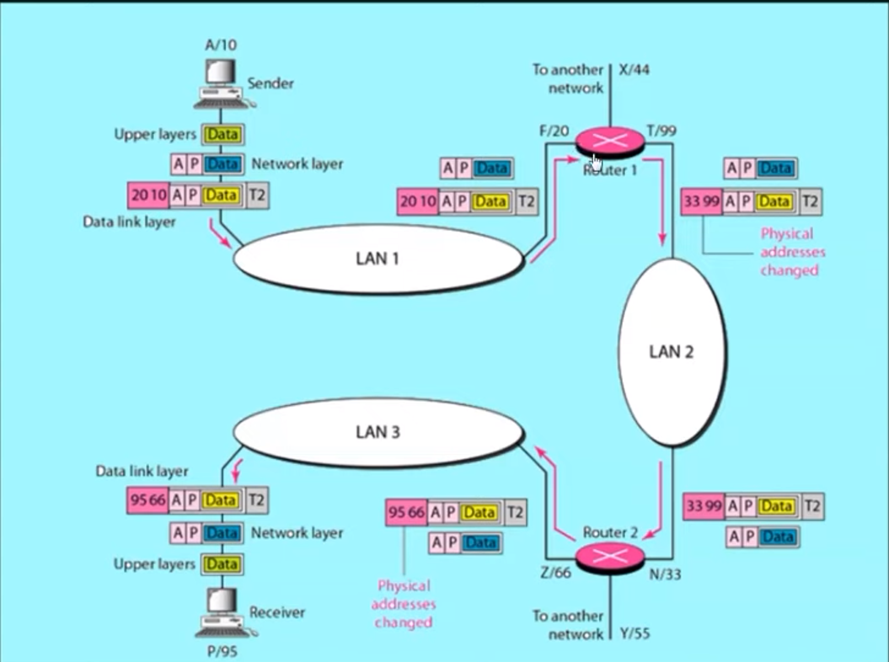

Mac address -> name of person
ip address -> address of person

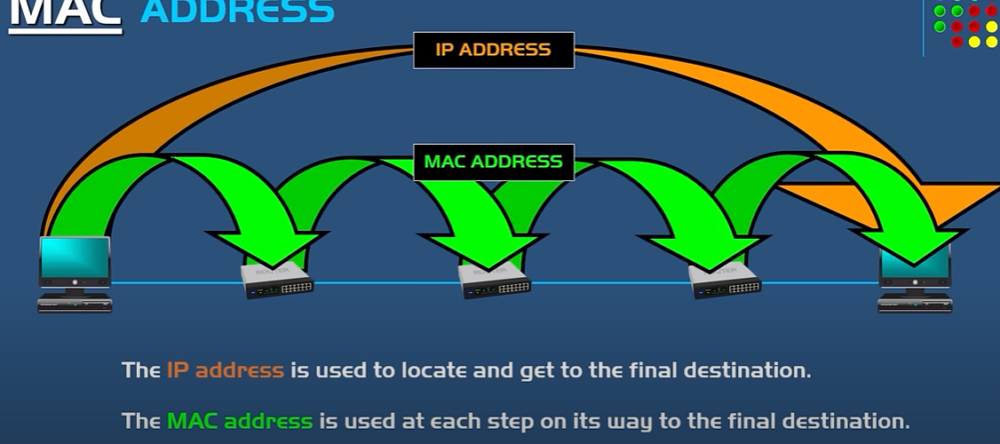

**how our computer find out the address of router or other computer Mac adress for data link layer?**
it send a brotcast msg with ip (default gateway):

computer: who has this (ip)? and whats your Mac address?

*you can check other mac address with arp -a*

# NETWORKING COMMANDS

# WINDOWS

ipconfig - private ip

ipconfig /all - mac address

nslookup - dns lookup

tracert - check the data packet travel path.

# LINUX

ifconfig - private ip

ifconfig -a **OR** ip address show - mac address

nslookup **OR** dig - dns lookup

traceroute - check the data packet travel path.
