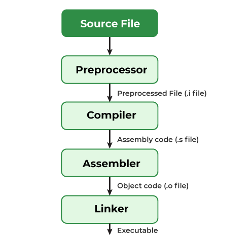

# Notes

# how C code is converted in machine code

Programs written in high-level languages like C must be translated into machine-readable instructions before they can execute on a computer.

The **GCC compiler** driver performs this translation through a four-phase compilation system that progressively transforms source code (c code) into an executable binary file (machine code).

### **Preprocessing Phase:**

**C File —> clean C File**

The preprocessor (cpp) modifies the original C source code by processing directives that begin with '#' (includes) 

- It removes all comments
- expands macros to their defined values
- includes header files directly into the code (**`#include <stdio.h>`** is replaced with the entire contents of stdio.h)

**output**: modified C program with a .i extension

### Compiler phase:

**clean C File —> Assembly language File**

The compiler (cc1) translates the preprocessed .i file into assembly language, producing a .s file

**assembly language**: Assembly language serves as an intermediate representation that different high-level languages (C, Fortran, etc.) can compile to, providing a common ground. Each line in the assembly file represents a low-level machine instruction in textual form, such as **`movl`** or **`call`** instructions

**output**: producing a .s file in assembly language

### **Assembly Phase:**

**Assembly language File —> Binary File**

The assembler (as) converts assembly language instructions from the .s file into actual machine code—binary instructions the processor can execute.

**output** : relocatable object file (.o extension) containing binary-encoded instructions.

### Linker Phase:

**Binary File + all other files (printf.o) —> executable** 

if we have `printf` function in our file the compiler create a separate precompiled object file called printf.o which must be merged with our hello.o program The linker (ld) handles this merging The result is an executable object file—or simply executable—called **hello**

**ready to be loaded into memory and executed by the system**

---

### Compiler (in detail):

how the english text is converted into assembly code? heres how:
there are these steps:

1. Lexical analysis (Lexical = vocabulary)
2. Syntax analysis (Syntax = format/way)
3. Semantic analysis (Semantic = logic)
4. Intermediate code generation
5. Optimization
6. Code generation

1. **Lexical analysis**
the compiler reads your source code converts it into **tokens *(token represents a single meaningful element that can't be subdivided further , like a word! )*.**
    
    
    
    **Lexical analyser** groups characters into tokens based on the language's syntax. It removes whitespace, comments, and newlines since they're not needed.
    

1. **Syntax analysis**
Syntax analysis (also called parsing) check code is following grammer rule of the programming language or not. with the use of tokens generated by Lexical analysis.
    
    
    
                                 **Abstract Syntax Tree (AST)**
    
    Tokens are used to create a structure called an **Abstract Syntax Tree (AST) or Parse tree. (shows logical structure of code)**
    
2. **Semantic analysis**
in Semantic phase compiler uses abstract syntax tree to check these three steps:

**type checking** - Ensures operations use compatible data types. Example error: **`int x = "hello";` 
flow checking -** check if flow is correct. Example `break` is outside the loop or classes called incorrectly.
**Label checking -** if reserved function like `if` or `else` used as variable name or not.

> **why its is this step if we already checked grammar (syntax analysis)?**
*Some errors can't be caught by just checking grammar—you need to understand what the code means.* 😊
> 

1. **Intermediate code generation**
converts source code into simplified, platform-independent format called **Intermediate Representation (IR) (it like a universal translator).**

it is generated because give a common ground for frontend (language code) and backend (machine code).
    - Frontends: “language → IR” (C → IR, Rust → IR, etc.)
    - Backends: “IR → machine code” (IR → x86, IR → ARM, IR → RISC‑V)

> Fun fact : That's how Java programs work on all systems—the Java compiler outputs intermediate code (bytecode), and users run it on their machine's JVM.
> 

1. **Optimization**
    - Takes IR and tries to make it **faster/smaller**, without changing behavior:
        - Remove dead code (never used).
        - Fold constants (**`2 + 2`** → **`4`**).
        - Eliminate repeated calculations.
        - Improve loops, reuse registers, etc.
2. **Code generation**
takes optimised IR code and convert it into machine code:
**Assembly code** (human-readable but CPU-specific) like **`MOV`**, **`ADD`**, **`JMP`**, **`CALL` 
or** directly into **binary machine code.**

PRACTICAL EXAMPLE

